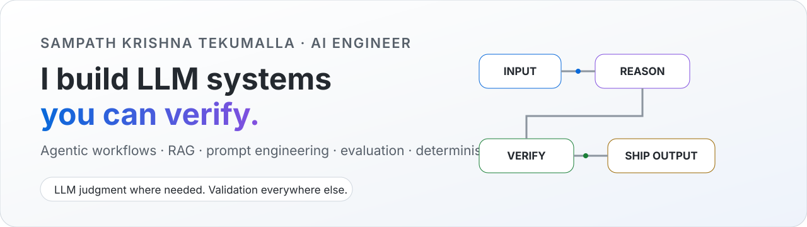
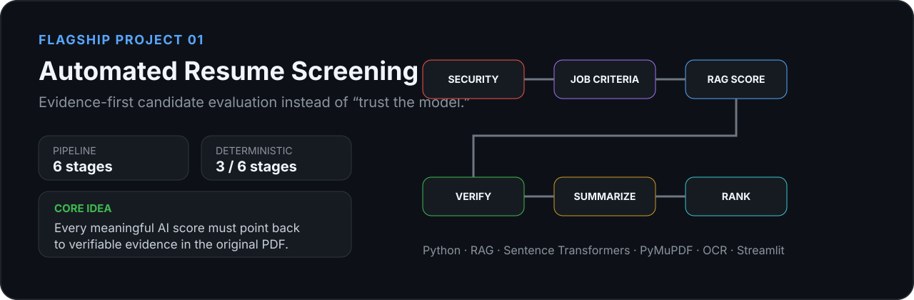
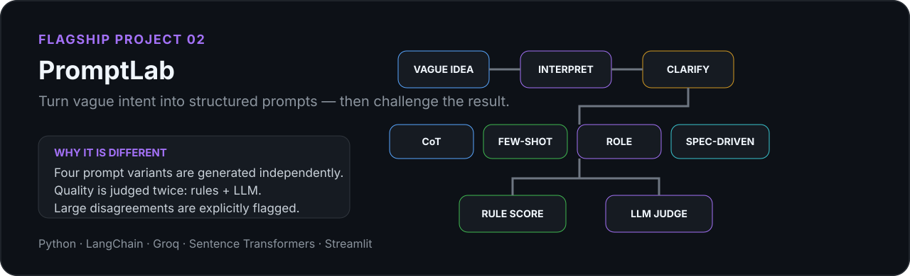
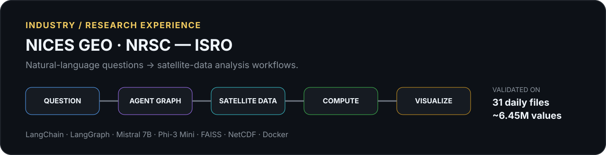

<picture>
  <source media="(prefers-color-scheme: dark)" srcset="./assets/hero-dark.svg">
  <source media="(prefers-color-scheme: light)" srcset="./assets/hero-light.svg">
  
</picture>

  <a href="https://www.linkedin.com/in/sampath2211"><b>LinkedIn</b></a>
  ·
  <a href="https://github.com/Sampath-2211?tab=repositories"><b>Projects</b></a>

---

## ⚡ 10-second version

I’m an **AI Engineer** working on systems where LLMs have to do more than generate text.

My focus is the layer between **“the model answered”** and **“the answer is reliable enough to use”** — agentic workflows, structured extraction, RAG, grounding, evaluation, prompt engineering, and deterministic validation.

<table>
<tr>
<td width="33%" valign="top">

### 🧠 Build
Agentic AI workflows, RAG pipelines, structured LLM extraction and prompt systems.

</td>
<td width="33%" valign="top">

### 🛡️ Verify
Citation checks, deterministic rules, fallback logic, grounding and hallucination controls.

</td>
<td width="33%" valign="top">

### 🚀 Ship
Python applications with Streamlit, LangChain/LangGraph, APIs, Docker and cloud tooling.

</td>
</tr>
</table>

---

# Selected Work

### Why I built it

Most AI screening systems give you a score and ask you to trust it. I wanted the opposite: **every important score should be traceable back to evidence in the original resume**.

The system combines AI reasoning with deterministic verification. It retrieves relevant resume evidence, produces requirement-level scores, validates the model’s quoted proof, catches unsupported claims, detects hidden-text manipulation, and lets a reviewer jump back to the source PDF.

**The part I care about most:** the AI is not the final authority — its output has to survive verification.

**Explore → [Automated-Resume-Screening](https://github.com/Sampath-2211/Automated-Resume-Screening)**

---

### Why I built it

Prompt quality is usually judged by feel. PromptLab turns that into a more explicit engineering process.

It interprets vague intent, asks targeted clarifying questions, generates four independent prompt strategies, then evaluates the result using **two different perspectives**: deterministic structural scoring and an LLM judge. When those disagree materially, the system flags it instead of pretending the score is certain.

**The idea:** use LLMs for judgment, but don’t let the LLM grade its own homework without a second signal.

**Explore → [PromptLab](https://github.com/Sampath-2211/PromptLab)**

---

# Work Beyond GitHub

### NICES GEO · NRSC — ISRO

During my internship at **NRSC, ISRO**, I built an agentic geospatial workflow that translated natural-language questions into satellite-data analysis.

The workflow used specialized processing nodes for query understanding, data discovery, loading, computation, visualization, and natural-language response generation. I combined validated processing functions with LLM-generated code so the system could stay flexible without making every step unconstrained.

One validation run processed **31 daily satellite files and ~6.45 million values**, automatically producing the requested statistic plus trend and spatial visualizations.

---

# What I work on professionally

My current work is centered on **LLM-based structured extraction from complex business documents**.

That means turning real client requirements into extraction logic: source hierarchy, precedence, fallback rules, exclusions, normalization, deduplication, validation constraints, and edge-case handling — then testing model behavior across difficult documents and iterating when the outputs fail.

It’s less about “writing prompts” and more about **engineering predictable behavior around probabilistic models**.

---

# Engineering Toolbox

| Area | Tools / Concepts |
|---|---|
| **LLM Systems** | LangChain, LangGraph, RAG, agentic workflows, structured extraction |
| **Reliability** | grounding, citation validation, deterministic checks, fallback logic, LLM evaluation |
| **Models / APIs** | Groq, Mistral, Phi, local LLM workflows |
| **Retrieval** | FAISS, Sentence Transformers, semantic search |
| **Backend / Apps** | Python, Flask, Streamlit |
| **Infrastructure** | Docker, Git, AWS, GCP |
| **Data** | SQL, NetCDF, document/PDF processing |

---

# Smaller Experiments

These are intentionally smaller projects where I test one idea at a time.

**[few-shot-translator](https://github.com/Sampath-2211/few-shot-translator)** — explores few-shot prompting and in-context style control.

**[personal-recruiter](https://github.com/Sampath-2211/personal-recruiter)** — maps resume evidence to job requirements and generates tailored application drafts.

---

## I’m interested in AI Engineer roles where reliability matters.

**Agents · RAG · LLM workflows · evaluation · structured extraction · applied AI**

<a href="https://www.linkedin.com/in/sampath2211"><b>Let’s connect on LinkedIn →</b></a>

